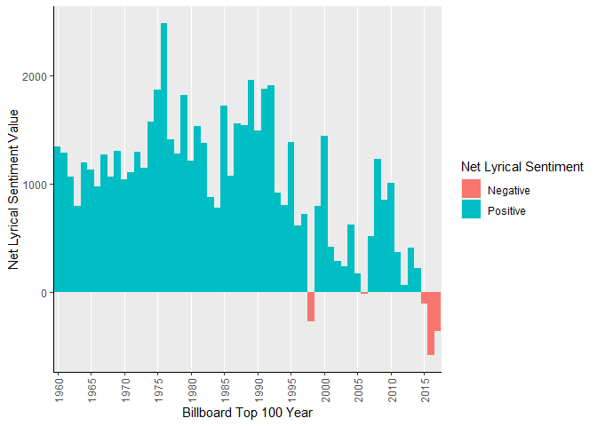
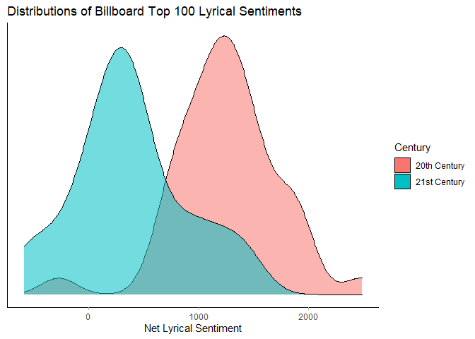

Spotify Sentinment Analysis
================
John Rollman
7/7/2021

-   [Introduction](#introduction)
-   [Packages](#packages)
-   [Import Data](#import-data)
-   [Run Sentiment Analysis](#run-sentiment-analysis)
-   [Analyze Initial Results](#analyze-initial-results)
    -   [Part 1 Summary](#part-1-summary)
        -   [Conclusions](#conclusions)
        -   [The Big Picture](#the-big-picture)

# Introduction

For this analysis I have a couple goals I would like to work on.

1.  Use NLP sentiment analysis on top 100 billboard songs to determine
    lyric sentiment.
    -   Have lyrical sentiments over time become more or less positive?
    -   Is the current century statistically different from the last?
2.  Analyze song quality markers to determine if there is any
    correlation to sentiment.

# Packages

``` r
library(tidyverse)
library(tidytext)
library(textdata)
```

# Import Data

Courtesy of [Derek Zhao](https://github.com/zhao1701)

``` r
#Read CSV
spotDat <- read.csv("billboard-lyrics-spotify.csv") 

#Tokenize Lyrics
spotSent <- spotDat %>%
  select(c(artist_base,song,lyrics)) %>%
  unnest_tokens(word, lyrics)
```

# Run Sentiment Analysis

``` r
#Calculate sentiment by song/artist
trial1 <- spotSent %>% 
  inner_join(get_sentiments("afinn"), by = 'word') %>% 
  group_by(index = song, artist_base) %>% 
  summarise(sentiment = sum(value)) %>% 
  mutate(method = "AFINN")
```

# Analyze Initial Results

``` r
#Summarize sentiment for each year
spotDat1 <- spotDat %>%
  inner_join(trial1, by = c('song'='index','artist_base'='artist_base')) %>%
  group_by(year) %>%
  summarise(net_sent = sum(sentiment), avg_sent = mean(sentiment)) %>%
  mutate(net_col = if_else(net_sent>=0,'Positive','Negative'),
         avg_col = if_else(avg_sent>=0,'Positive','Negative'),
         century = if_else(year>=2000,'21st Century','20th Century'))

#Plot net sentiment and avg sentiment over the years
ggplot(spotDat1, aes(x=factor(year), y=net_sent)) +
  geom_col(width = 1, aes(fill=net_col)) +
  scale_x_discrete(breaks = spotDat1$year[c(T,F,F,F,F)]) +
  theme(axis.text.x = element_text(angle = 90, vjust = 0.5)) +
  labs(x = 'Billboard Top 100 Year', y = 'Net Lyrical Sentiment Value') +
  scale_fill_discrete(name='Net Lyrical Sentiment') + 
  theme(panel.border = element_blank(), panel.grid.major.x = element_line( size=.1, color="white" ), panel.grid.major.y = element_blank(),
  panel.grid.minor = element_blank(), axis.line = element_line(colour = "black"))
```

<!-- -->

``` r
# ggplot(spotDat1, aes(x=factor(year), y=avg_sent)) +
#   geom_col(width = 1, aes(fill=avg_col)) +
#   scale_x_discrete(breaks = spotDat1$year[c(T,F,F,F,F)]) +
#   theme(axis.text.x = element_text(angle = 90, vjust = 0.5)) +
#   labs(x = 'Billboard Top 100 Year', y = 'Avg Lyrical Sentiment Value') +
#   scale_fill_discrete(name='Avg Lyrical Sentiment') + 
#   theme(panel.border = element_blank(), panel.grid.major.x = element_line( size=.1, color="white" ), panel.grid.major.y = element_blank(),
#   panel.grid.minor = element_blank(), axis.line = element_line(colour = "black"))
 
#Hypothesis: Are 21st century Top 100 Songs less positive than the latter half of the 20th century? A simple t test could be sufficient.
ggplot(spotDat1, aes(net_sent)) +
  geom_density(aes(group = factor(century), fill = factor(century), alpha=.5)) + 
  theme_light() +
  theme(panel.border = element_blank(),
        panel.grid.major = element_blank(),
        panel.grid.minor = element_blank(),
        axis.line = element_line(colour = "black"),
        axis.title.y=element_blank(),
        axis.text.y=element_blank(), 
        axis.ticks.y=element_blank()) +
  scale_fill_discrete(name='Century') + 
  guides(alpha='none') +
  labs(title = 'Distributions of Billboard Top 100 Lyrical Sentiments', x = 'Net Lyrical Sentiment')
```

<!-- -->

``` r
#Performing a Simple Linear Regression of Century on Net_Sent using OLS (Sorry boot-campers, no gradient descent for this test)
htest <- lm(net_sent ~ century, data=spotDat1)
summary(htest)
```

    ## 
    ## Call:
    ## lm(formula = net_sent ~ century, data = spotDat1)
    ## 
    ## Residuals:
    ##      Min       1Q   Median       3Q      Max 
    ## -1530.42  -263.92     1.54   265.06  1228.58 
    ## 
    ## Coefficients:
    ##                     Estimate Std. Error t value Pr(>|t|)    
    ## (Intercept)          1256.42      76.86  16.348  < 2e-16 ***
    ## century21st Century  -880.92     137.96  -6.385 3.57e-08 ***
    ## ---
    ## Signif. codes:  0 '***' 0.001 '**' 0.01 '*' 0.05 '.' 0.1 ' ' 1
    ## 
    ## Residual standard error: 486.1 on 56 degrees of freedom
    ## Multiple R-squared:  0.4213, Adjusted R-squared:  0.411 
    ## F-statistic: 40.77 on 1 and 56 DF,  p-value: 3.566e-08

``` r
#T-test indicates a significant relationship between century and lyrical sentiment
anova(htest)
```

    ## Analysis of Variance Table
    ## 
    ## Response: net_sent
    ##           Df   Sum Sq Mean Sq F value    Pr(>F)    
    ## century    1  9633462 9633462  40.771 3.566e-08 ***
    ## Residuals 56 13231734  236281                      
    ## ---
    ## Signif. codes:  0 '***' 0.001 '**' 0.01 '*' 0.05 '.' 0.1 ' ' 1

``` r
#Coeffecients
htest$coefficients
```

    ##         (Intercept) century21st Century 
    ##            1256.425            -880.925

## Part 1 Summary

### Conclusions

For the majority of the last 50+ years, the lyrical sentiment of the
Billboard Top 100 has been generally ‘positive’. In 1998, lyrical
sentiment dipped into the negatives for a year, followed by a resurgence
of positive sentiment. In 2000, there was a drastic shift back to
positive only to slowly dwindle back down. Overall, the 21st century has
seen song lyrics become overall less positive. It is important to
remember that this is only the Billboard’s Top 100 and the sentiment is
simply a reflection of the lyrics not the music itself. Have you ever
listened to a song that you considered a “banger” only to listen to the
lyrics and realize how dark or sad the song may be. This is what I would
like to dig into further. How the lyrical sentiment correlates with the
music features. Using a different sentiment analysis lexicon we can dig
into which emotions are generally being displayed in these songs, such
as joy, anger, fear, etc. More parts to come!

### The Big Picture

The reason this interests me is because words matter. Psychologists
agree that our mental health can be affected by the words we use to
others. Thus, despite songs being upbeat or not, does the inherent
lyrical sentiment affect us in a physiological way. Does listening to a
song we think evokes upbeat positivity but lyrically conveys negativity,
act as a detriment to our mental health.
